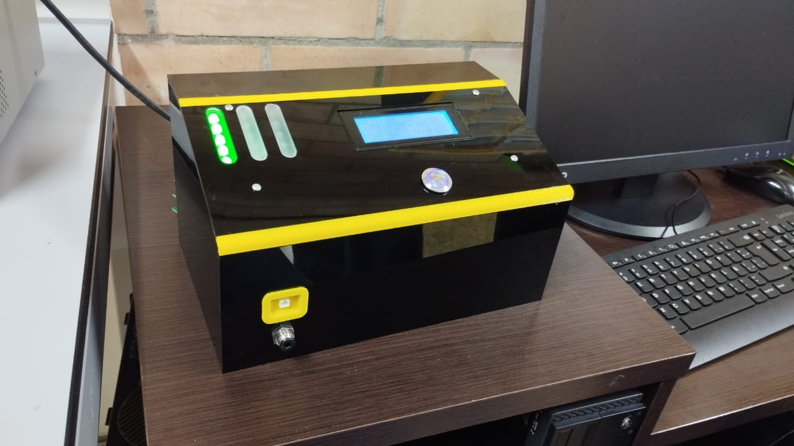

# BufeoValve_TB

This project involves the development of the Test Bench system to the electrovalves of BUFEO

## Version v1.0

This version contains:

- First version of User Interface Unit
- First version of Test Execution Unit
- First version of Current Monitor Unit

To Do:

Make a test with real hardware to improve the threshold levels for each test

